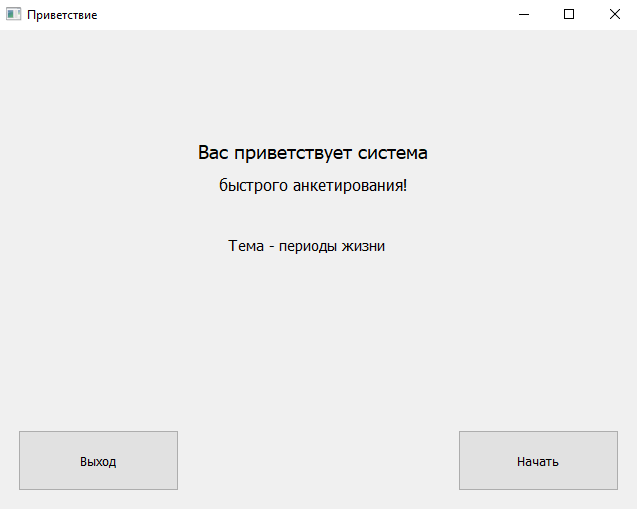
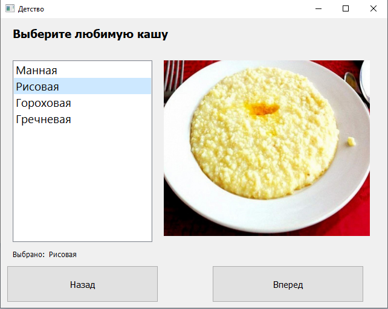
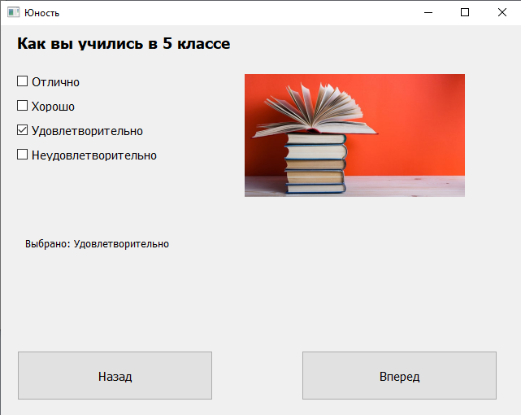
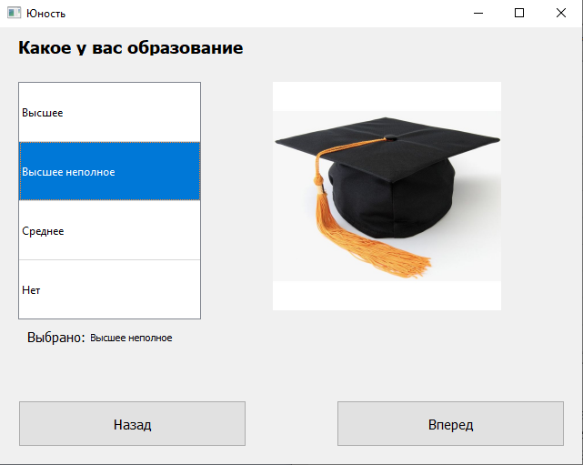
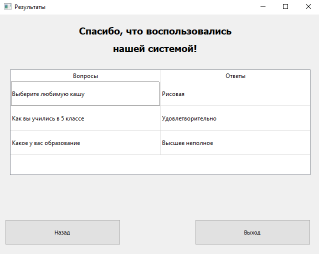

8. Создать многоокноое приложение на следующую тематику:
		окно 1: Приветствие
		окно 2: Детство (QListWidget)
		окно 3: Отрочество (QRadioButton)
		окно 4: Юность (QComboBox)
		окно 5: Благодарность (QLineEdit)
Окно 1:

Окно 2:

Окно 3:

Окно 4:

Окно 5:
